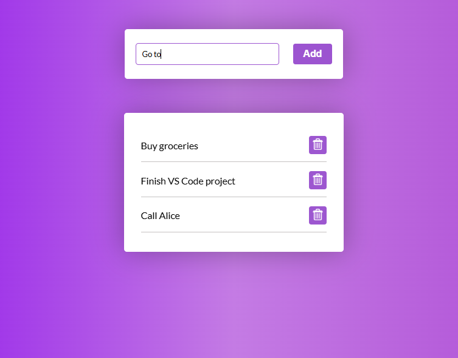

# Todo List App

A simple and interactive **Todo List** web application built with HTML, CSS, and JavaScript. Users can add tasks, mark them as completed, and delete tasks dynamically.  

---

## Preview

---

## Features

- Add new tasks using the input field or pressing `Enter`.  
- Mark tasks as completed by clicking on the task name.  
- Delete tasks using the trash icon.  
- Dynamic rendering ensures smooth updates without page reloads.  
- Subtle UI feedback using focus effects and completed task styling.

---

## Technologies Used

- HTML5  
- CSS3  
- JavaScript (ES6+)  

---

## Usage

1. Clone or download the repository.  
2. Open `index.html` in a web browser.  
3. Start adding, completing, and deleting tasks interactively.  

---

## File Structure

root/
├─ index.html
├─ script.js
├─ style.css
├─ screenshot.PNG

## Inspiration

This project was inspired by [Cymentho's step-by-step tutorial on Dev.to](https://dev.to/iamcymentho/how-to-build-a-functional-to-do-list-app-with-javascript-html-and-css-a-step-by-step-guide-h9f).  

---

## Author

Samuel Fikiru  

---

## License

This project is open-source and free to use.
